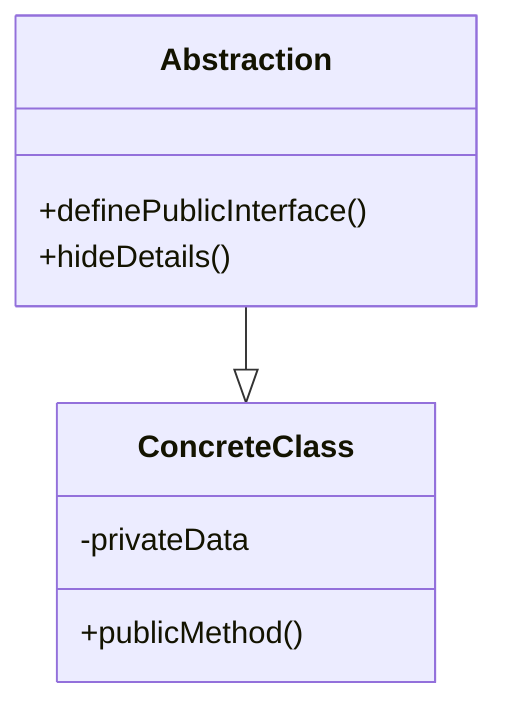

## Polymorphism

Polymorphism in C++ is a powerful concept that allows objects of different classes to be treated as objects of a common base class. It enables you to write code that can work with objects in a more general and flexible way, regardless of their specific types. This is achieved through the use of virtual functions and pointers or references to base class objects.

**How Polymorphism Works:**

1. **Base Class with Virtual Function:** [see more about virtual](03/README.md)<br>
   To enable polymorphism, you typically create a base class with one or more virtual functions. A virtual function is a function in the base class that is intended to be overridden by derived classes. This allows each derived class to provide its own implementation of the function.

2. **Derived Classes Override Virtual Function:**<br>
   Each derived class that wants to participate in polymorphism overrides the virtual function(s) declared in the base class. This means that the derived class provides its own version of the function with the same signature.

3. **Pointer or Reference to Base Class:**<br>
   You can create pointers or references of the base class type that can point to objects of either the base class or its derived classes. This is where the magic of polymorphism happens. When you call a virtual function using such a pointer or reference, the appropriate version of the function is called based on the actual type of the object pointed to.

Here's an example to illustrate how polymorphism works:

```cpp
#include <iostream>

class Animal {
public:
    virtual void makeSound() {
        std::cout << "Animal makes a sound." << std::endl;
    }
};

class Cat : public Animal {
public:
    void makeSound() override {
        std::cout << "Cat meows." << std::endl;
    }
};

class Dog : public Animal {
public:
    void makeSound() override {
        std::cout << "Dog barks." << std::endl;
    }
};

int main() {
    Animal* ptrAnimal;
    
    Cat cat;
    Dog dog;

    ptrAnimal = &cat;
    ptrAnimal->makeSound(); // Calls Cat's version of makeSound()

    ptrAnimal = &dog;
    ptrAnimal->makeSound(); // Calls Dog's version of makeSound()

    return 0;
}
```

In this example, the base class `Animal` has a virtual function `makeSound()`. The derived classes `Cat` and `Dog` override this function with their own implementations. In the `main()` function, pointers of type `Animal*` are used to point to objects of both `Cat` and `Dog`. When `makeSound()` is called using these pointers, the appropriate version of the function is executed based on the actual type of the object they point to.

This flexibility and behavior of choosing the correct function to call at runtime based on the actual object type is what defines polymorphism in C++. It allows you to write more generic and flexible code, making your programs more extensible and easier to manage.

## Abstraction

Abstraction in C++ is like using a remote control for a complicated machine. You don't need to know every little detail about how the machine works; you just press buttons on the remote to make it do what you want. In programming, abstraction is a concept that allows you to create a simplified representation of an object by focusing on its essential properties and behaviors, while hiding the unnecessary details. It helps in managing complexity by providing a clear interface for interacting with objects without needing to know the internal implementation details.

An abstract class in C++ is a class that cannot be instantiated directly and is meant to serve as a blueprint for other classes. It often contains pure virtual functions (functions without implementation) A pure virtual function is declared using the syntax virtual ReturnType functionName() = 0; It must be overridden by its derived classes. Abstract classes are used to define a common interface and behavior that should be shared among multiple related classes.

### Features of Abstraction

1. **Hiding Complexity**: Abstraction allows us to hide the inner workings of a class or system, showing only the essential parts that are necessary for its use. This reduces complexity and makes our code easier to understand.

2. **Creating Classes**: We can use abstraction to create classes that represent real-world objects or concepts. These classes contain data (attributes) and methods (functions) that work together to provide a clear interface.

3. **Public Interface**: Abstraction lets us define a clear public interface for a class. This interface shows the functions that others can use to interact with the class, while hiding the implementation details.

4. **Encapsulation**: Abstraction and encapsulation go hand in hand. Encapsulation means bundling data and methods that work on that data into a single unit (class). Abstraction helps us define what that unit does without revealing its internal details.

### How to Use Abstraction

1. **Define Classes**: Identify the real-world objects or concepts you want to represent. Create classes that have attributes to store data and methods to perform actions.

2. **Public Methods**: Choose which methods you want to expose to users of the class. These methods become the public interface that others will interact with.

3. **Hide Details**: Keep the inner workings of the class hidden by marking data members as `private`. This prevents direct access from outside the class and ensures controlled interaction.



In summary, abstraction in C++ allows us to create simplified models of real-world concepts, hide complexity, and provide a clear public interface. By using well-defined classes and methods, we can build code that's easier to understand, maintain, and extend. Remember to keep your classes focused, use access modifiers wisely, and document your code for others to use effectively.

### Example: Abstraction with Public Interface

Let's say we want to create an abstract class `Shape` that represents different geometric shapes. We'll define a pure virtual function `area()` in the `Shape` class to represent the area of the shape. Then, we'll create concrete classes `Circle` and `Rectangle` that inherit from `Shape` and provide their implementations of the `area()` function.

```cpp
#include <iostream>

// Abstract base class
class Shape {
public:
    virtual double area() const = 0; // Pure virtual function
};

// Derived classes
class Circle : public Shape {
private:
    double radius;

public:
    Circle(double r) : radius(r) {}

    double area() const override {
        return 3.14159 * radius * radius;
    }
};

class Rectangle : public Shape {
private:
    double width;
    double height;

public:
    Rectangle(double w, double h) : width(w), height(h) {}

    double area() const override {
        return width * height;
    }
};

int main() {
    Circle circle(5);
    Rectangle rectangle(4, 6);

    std::cout << "Circle Area: " << circle.area() << std::endl;
    std::cout << "Rectangle Area: " << rectangle.area() << std::endl;

    return 0;
}
```

## Interface

**What is an Interface?**

An interface is a blueprint in C++ that defines a set of methods (functions) that a class must implement. It enforces a contract, ensuring that derived classes provide specific functionality. While C++ doesn't have a dedicated `interface` keyword, you achieve interfaces through abstract classes and pure virtual functions.

**When and Where to Use an Interface:**

Use an interface when you want to:
- Define a common set of methods that different classes should implement.
- Ensure that classes adhere to a specific contract without sharing implementation details.
- Create a consistent way of interacting with objects of various types.

**Key Difference between Interface and Abstract Class:**

1. **Abstract Class**:
   - Can have both concrete (implemented) methods and pure virtual methods.
   - Provides the option to share implementation among derived classes.
   - Can have data members and constructors.
   - Cannot be instantiated directly.
   
2. **Interface**:
   - Contains only pure virtual methods (no concrete implementations).
   - Focuses solely on enforcing a contract.
   - Has no data members or constructors.
   - Cannot be instantiated directly.

**Example**
```c++
#include <iostream>

// Interface
class Shape {
public:
    virtual double area() const = 0; // Pure virtual method
    virtual double perimeter() const = 0; // Another pure virtual method
};

// Derived class implementing the interface
class Circle : public Shape {
private:
    double radius;

public:
    Circle(double r) : radius(r) {}

    double area() const override {
        return 3.14159 * radius * radius;
    }

    double perimeter() const override {
        return 2 * 3.14159 * radius;
    }
};

int main() {
    Circle circle(5);

    Shape* shapePtr = &circle;

    std::cout << "Circle Area: " << shapePtr->area() << std::endl;
    std::cout << "Circle Perimeter: " << shapePtr->perimeter() << std::endl;

    return 0;
}

```