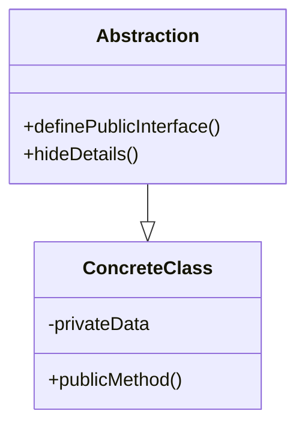

## Abstraction in C++

Abstraction in C++ is like using a remote control for a complicated machine. You don't need to know every little detail about how the machine works; you just press buttons on the remote to make it do what you want. In programming, abstraction lets us hide the complicated parts of a system and focus on what we need.

### Features of Abstraction

1. **Hiding Complexity**: Abstraction allows us to hide the inner workings of a class or system, showing only the essential parts that are necessary for its use. This reduces complexity and makes our code easier to understand.

2. **Creating Classes**: We can use abstraction to create classes that represent real-world objects or concepts. These classes contain data (attributes) and methods (functions) that work together to provide a clear interface.

3. **Public Interface**: Abstraction lets us define a clear public interface for a class. This interface shows the functions that others can use to interact with the class, while hiding the implementation details.

4. **Encapsulation**: Abstraction and encapsulation go hand in hand. Encapsulation means bundling data and methods that work on that data into a single unit (class). Abstraction helps us define what that unit does without revealing its internal details.

### How to Use Abstraction

1. **Define Classes**: Identify the real-world objects or concepts you want to represent. Create classes that have attributes to store data and methods to perform actions.

2. **Public Methods**: Choose which methods you want to expose to users of the class. These methods become the public interface that others will interact with.

3. **Hide Details**: Keep the inner workings of the class hidden by marking data members as `private`. This prevents direct access from outside the class and ensures controlled interaction.

### Best Practices for Abstraction

1. **Keep It Simple**: Only expose methods that are necessary for the intended use of the class. Avoid cluttering the public interface with too many methods.

2. **Single Responsibility**: Each class should have a clear purpose and responsibility. This keeps the code focused and makes it easier to maintain.

3. **Clear Naming**: Use descriptive names for classes, methods, and attributes. This helps others understand what each part does without looking at the details.

4. **Documentation**: Provide clear and concise documentation for your classes and methods. This helps users understand how to use them correctly.

5. **Use Access Modifiers**: Mark data members as `private` and methods as `public` or `protected` to control access. This enforces encapsulation and prevents unintended manipulation of data.

In summary, abstraction in C++ allows us to create simplified models of real-world concepts, hide complexity, and provide a clear public interface. By using well-defined classes and methods, we can build code that's easier to understand, maintain, and extend. Remember to keep your classes focused, use access modifiers wisely, and document your code for others to use effectively.